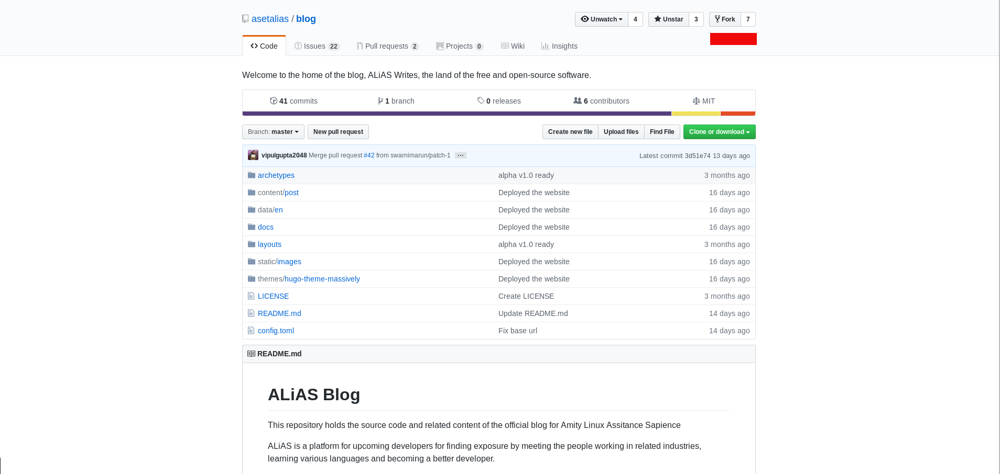
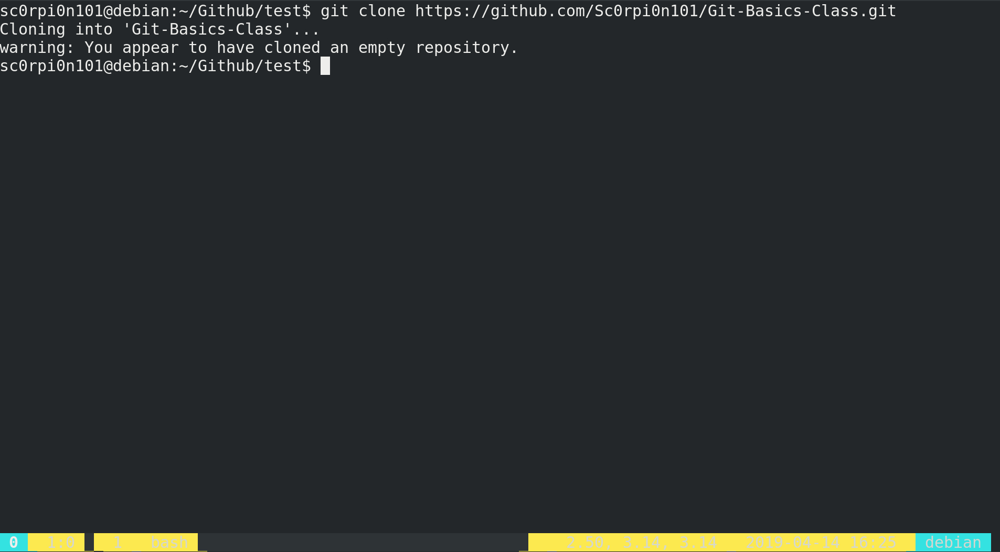
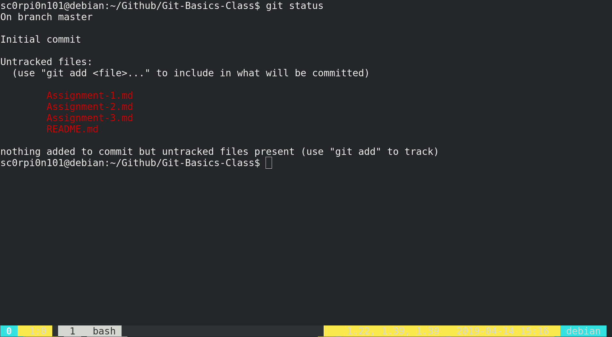
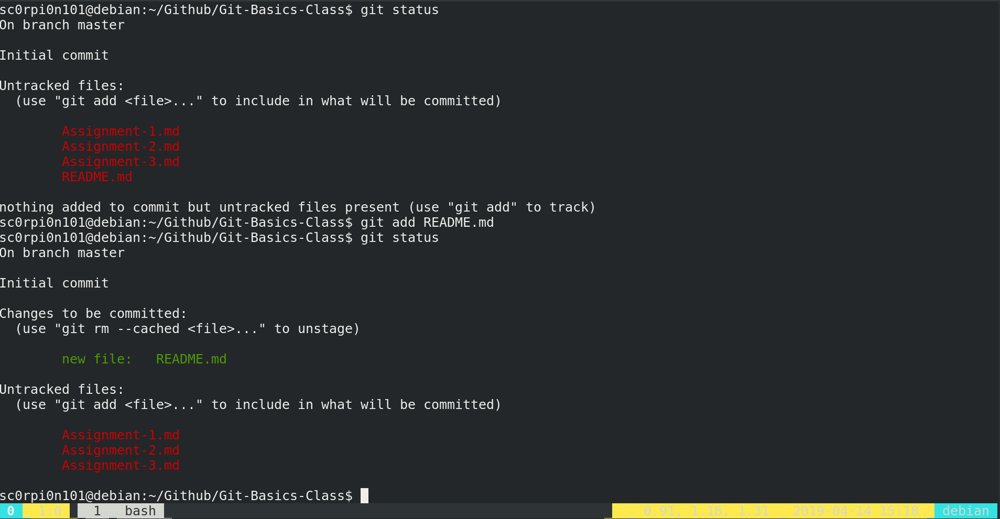
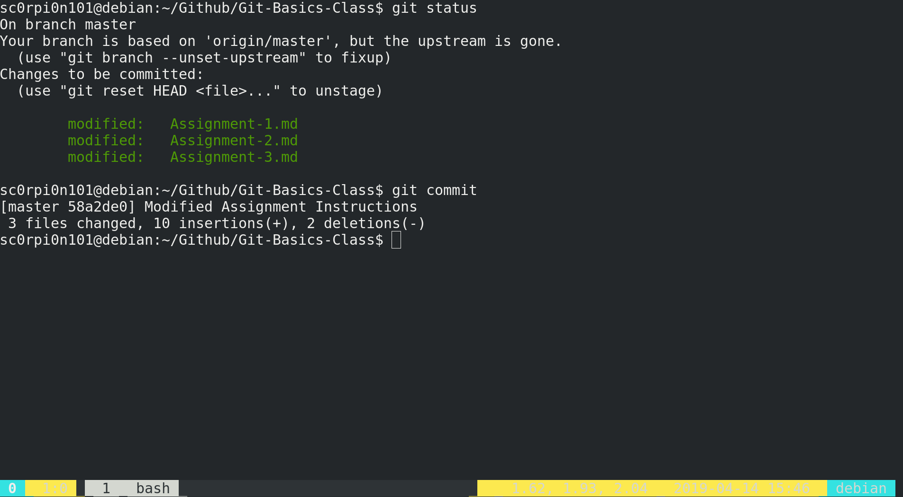
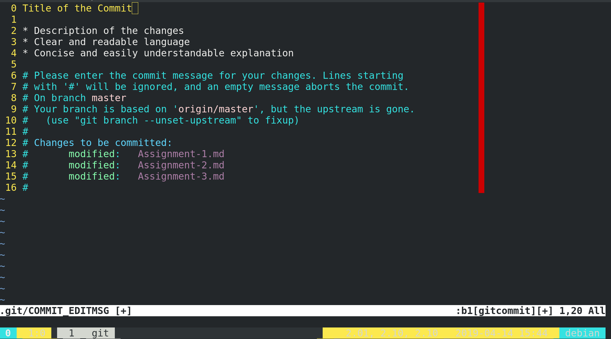
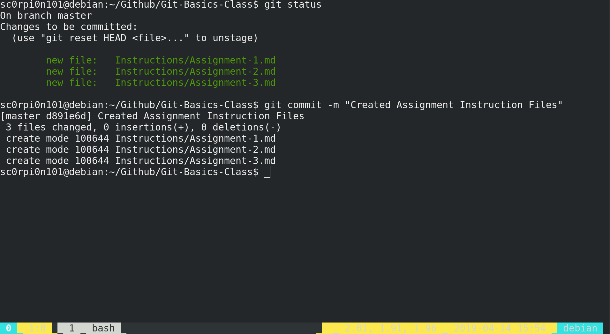
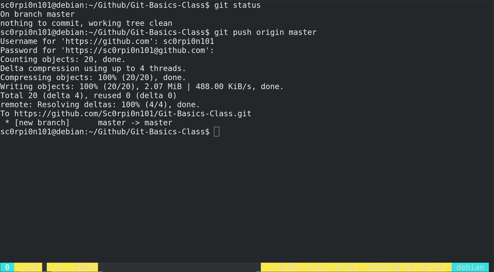
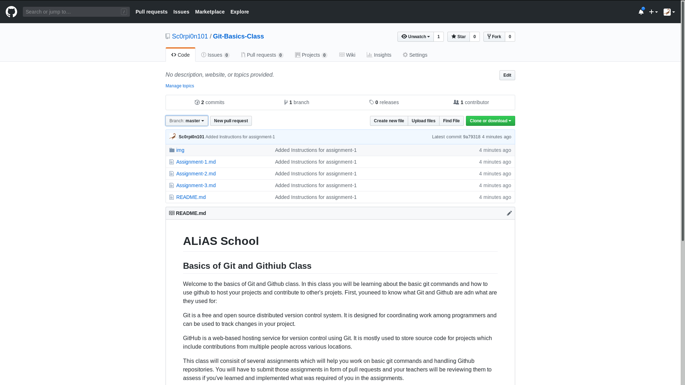
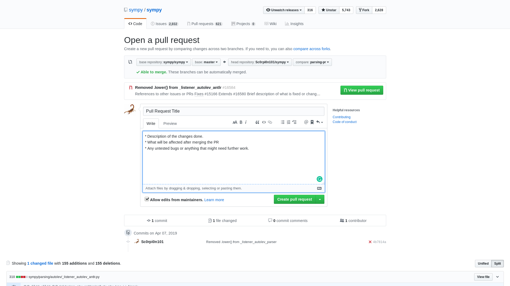

# ALiAS School - Basics of Git and Github

## Assignment - 1

## Introduction to Git and your first Pull Request

This is your first assignment which will introduce you to Git and Github.

In this assignment, you will be learning to set up a repository, making changes to the repository, saving the changes, updating your repository and creating a pull request.

Your tasks for this assignment are:

1) Fork the current repository using the fork button at the top right of the page. 

2) Clone the repository to make a local copy on your machine using `git clone https://github.com/<username>/<repo-name>`. 

3) Create two new files, one whose changes will be saved and one whose changes will be discarded and edit the files to your liking. You can try playing around as much as you like with your local copy of the repository, but you must have at least one new file to update your fork of the repository. 

4) You can use `git status` at to track the changes you have done at any point in time. 

5) Use `git add <file> to add the file to git tracking. You can also use `git add .` to add all the files in case of more than one files. Use `git rm --cached <file>` to untrack a file and `git checkout -- <file>` to discard the changes done in a file. 

__The `<file>` should be complete a complete filename: path/<file-name.extention>__ 

6) Use `git commit` to create your first commit and write your changes to your local repository's history. Your default editor will be opened after you run git commit. You can write your commit message there and close the editor to finish the commit. 

#### Commit Message Guidelines:

- First line of the commit message is used for the title briefly describing the work done.
- Leave one blank line after the title
- Add the explaination and description of changes done in the commit in clear language understandable by anyone else who decides to work on the module you worked on.
- Leave one blank line after the commit description.
- `git commit -m "commit message here"` can also be use for one line commits.

7) Use git push origin master to synchronize the changes made in the local copy with your fork of the repository present on your Github account. 

8) Visit `https://github.com/<username>/<repo-name>` and you can check if your changes have been updated. 

9) Next step is to use the pull request button at the top right of the code window to create a Pull Request to request your changes to be added to the main repository at the Organization's Github account. 

10) Your Pull Request will be reviewed by your teachers and will be merged in case it completes all the requirements of the assignment.
