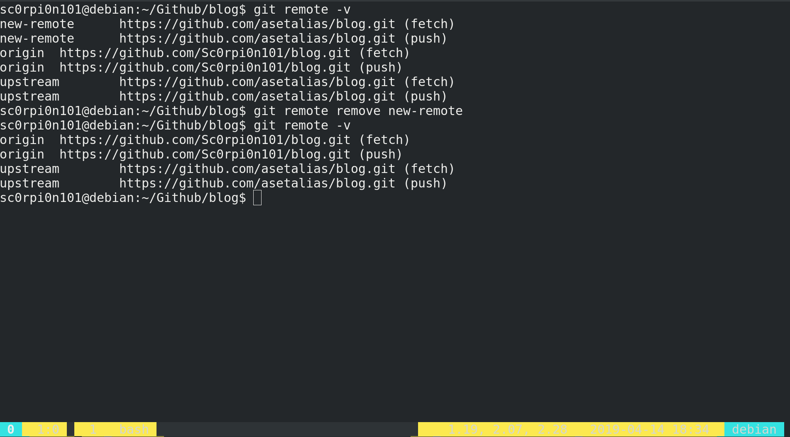
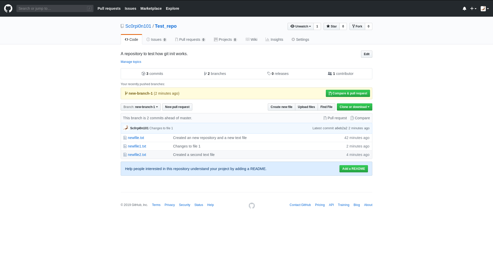

# ALiAS School - Basics of Git and Github

## Assignment - 2

## Creating your own repository, Pulling from upstream and Branching

This is your second assignment, which will introduce you to the concepts of Branching, git remote, pulling and fetching from a repository.

In this assignment, you will be learning to create your ownrepository in your machine, creating and working with branches and adding your new repository to your github account.

#### Creating a new Repository

1.  Make a new directory in your machine which you would like to be your new repository and cd into the directory from git bash or terminal.
2.  Use `git init` to initialize a new repository in the directory.

3.  You can now make changes inside the directory an use all the git commands as learned in Assignment-1 to save your changes.

4.  Go to your Github account and create a new repository with ideally the same name as the directory name but it can be different also.

5.  Copy the link beneath the title which will be the link to the repository.

6.  Use the command `git remote add origin <link-to-repo>` to add your repository address as origin to your local copy.

7.  You can now use `git push -u origin master` to synchronize your local copy to the repository at Github.

#### Git Remote and adding upstream

A remote in Git is a common repository that all team members use to exchange their changes. In most cases, such a remote repository is stored on a code hosting service like GitHub.

1.  You can use `git remote -v` to see your current list of remote linked to your repository.

2.  If you have an upstream repository from which you have forked your remote, you can go to the repository and copy it's link.
3.  Then, use `git remote add upstream <link-to-upstream>`.

4.  You can use `git remote add <remote-name> <remote-link>` to add any remote.

5.  To see detailed information about a remote, use `git remote show <remote-name>`.

6.  To rename a remote, use `git remote rename <old-name> <new-name>`.

7.  To delete a remote, use `git remote remove <remote-name>`.

8.  To add a new URL to a remote, use `git remote set-url --add <remote-name> <newurl>`.

9.  To remove a URL: from a remote, use `git remote set-url --delete <remote-name> <url>`

10. Use `git fetch <remote> <branch>` to get the updated data from the provided branch of the remote.

11. `git pull <remote> <branch>` can also be used to get the data, but it will automatically merge the new data with your current branch which you will learn more about in the next assignment.

#### Branching in git

 Branching means you diverge from the main line of development and continue to do work without messing with that main line. Branches are mainly used to work on different features at the same tm ewithout disturbing other features.

1. You can create a new branch in your current repository using `git branch <branch-name>`.

2. You can change your workflow to any branch using `git checkout <branch-name>`.

3. Any changes done and the commits added in a branch will stay in the same branch and will not disturbany other branch.

4. To add the branch you just created to your remote, use `git push -u <remote-name> <branch-name>`.

5. You can update the remote branch you are working on at any time later using `git push <remot-name> <branch-name>`.

6. You can see all your branches currenty active in the repository using `git branch -a`.

7. To delete a branch from your local repository, use `git branch -d <branch name>`.

8. To delete a branch from a remote , you can use `git push <remote-name> --delete <branch-name>`.

### Your Tasks for this assignment are:

1.  Create a new repository of your liking and make some changes to it.
2.  Create a remote on your Github account an update it using the new repository.
3.  Submit a Pull Request for the changes done in the new repository to be included in the assignment repository,
4.  Once the first pull request is merged, create a new branch in your repository and make some more changes in the branch.
5. Update your remote again with a new branch and thwe new changes.
6. Submit another Pull Request from the new branch to the assignment repository.
